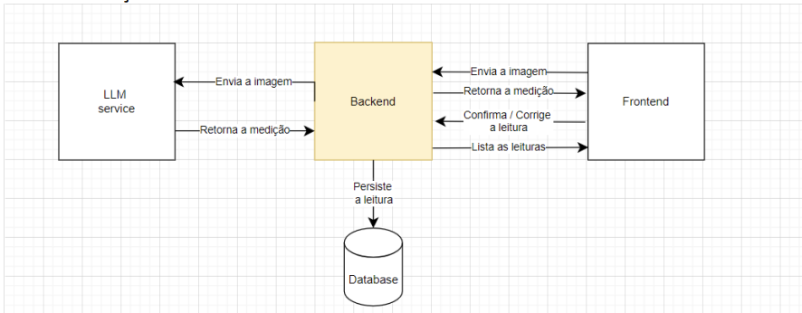

# Sistema de Leitura de Consumo de Água e Gás por Imagem

## Descrição

Este projeto é uma solução completa para a leitura de medidores de água e gás através de imagens, utilizando a API Google Gemini para extração dos valores dos medidores. Os dados são armazenados em um banco de dados gerenciado pelo Sequelize, e toda a aplicação é desenvolvida em TypeScript utilizando o framework Express.

## Tecnologias Utilizadas

- **Express**: Framework web para Node.js, responsável por fornecer a estrutura da API REST.
- **Google Gemini API**: Serviço avançado de inteligência artificial da Google para análise e extração de informações de imagens.
- **Sequelize**: ORM (Object-Relational Mapping) que facilita a interação com o banco de dados, permitindo manipulação e consulta de dados de forma mais intuitiva.
- **TypeScript**: Superset de JavaScript que adiciona tipagem estática ao código, melhorando a robustez e a manutenção do projeto.
- **Docker & Docker Compose**: Ferramentas de containerização utilizadas para configurar e rodar o ambiente de desenvolvimento de forma isolada e reprodutível.

## Como Rodar o Projeto

Para rodar o projeto localmente, siga os passos abaixo. Certifique-se de ter o Docker e Docker Compose instalados em sua máquina:

1. **Clonar o repositório**:

   ```bash
   git clone https://github.com/seu-repositorio/nome-do-projeto.git
   cd nome-do-projeto
   ```

2. **Configurar variáveis de ambiente**:
   Crie um arquivo `.env` na raiz do projeto com a seguinte configuração:

   ```env
   GEMINI_API_KEY=<sua-chave-da-api-gemini>
   ```

3. **Construir e iniciar os containers**:
   Execute o comando abaixo para iniciar a aplicação com Docker Compose:

   ```bash
   docker-compose up --build
   ```

   Este comando irá construir as imagens Docker, configurar os containers e iniciar a aplicação.

## Como Funciona


Esta imagem ilustra um cenário típico de medidor que o sistema processa para extrair os dados.

1. **Envio de Imagem**: O usuário envia uma imagem do medidor através de um endpoint da API.
2. **Processamento**: A imagem é processada pela API Google Gemini, que extrai o valor numérico do medidor.
3. **Armazenamento**: O valor extraído, juntamente com a imagem e outras informações, é armazenado em um banco de dados utilizando Sequelize.
4. **Confirmação**: O usuário pode confirmar os valores extraídos, garantindo a precisão da leitura.

## Links Úteis

- [Documentação do Google Gemini (API Key)](https://ai.google.dev/gemini-api/docs/api-key)
- [Documentação do Google Gemini (Vision)](https://ai.google.dev/gemini-api/docs/vision)
- [Instalação do Docker](https://docs.docker.com/get-docker/)
- [Instalação do Docker Compose](https://docs.docker.com/compose/install/)

---

Este projeto foi desenvolvido com foco em automação e precisão na leitura de medidores, proporcionando uma solução eficiente e moderna para o gerenciamento de consumo de água e gás.
